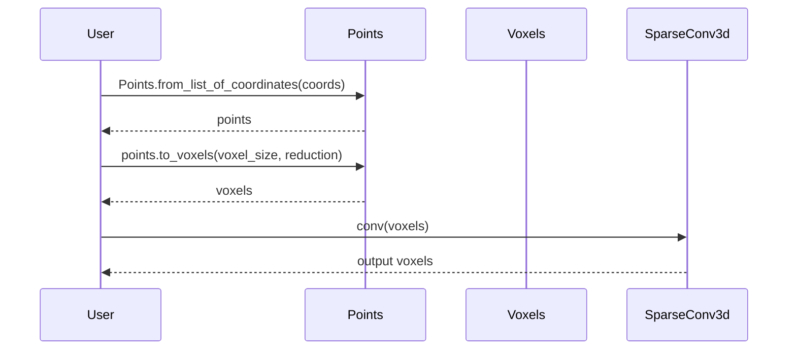

# API Sequence

```mermaid
sequenceDiagram
    participant User
    participant Points
    participant Voxels
    participant SparseConv3d

    User->>Points: Points.from_list_of_coordinates(coords)
    Points-->>User: points
    User->>Points: points.to_voxels(voxel_size, reduction)
    Points-->>User: voxels
    User->>SparseConv3d: conv(voxels)
    SparseConv3d-->>User: output voxels
```

The typical workflow: create a `Points` geometry from raw coordinates,
voxelize into `Voxels`, and pass through sparse convolution layers.
