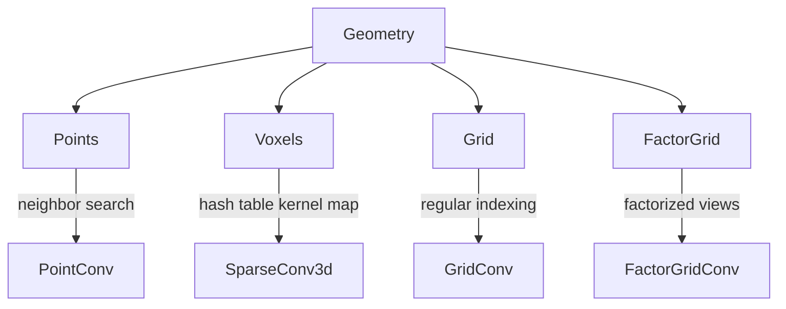

# Geometry Types

Each geometry type pairs with specific convolution operations. `Points` uses
real-valued neighbor search (KNN or radius). `Voxels` builds a kernel map via
hash table lookup. `Grid` and `FactorGrid` use regular grid indexing.
