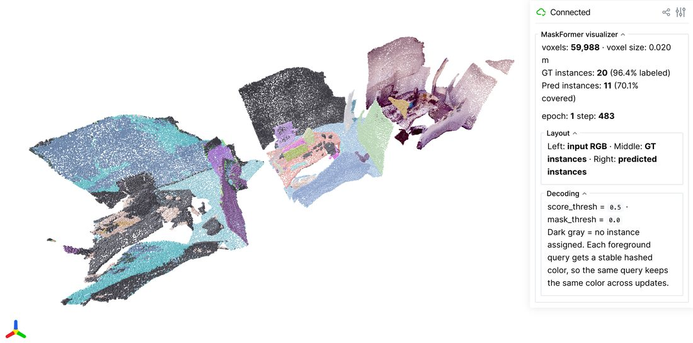

# MaskFormer Instance Segmentation

This example trains a 3D MaskFormer for **point-cloud instance / mask
prediction** on
[ScanNet](http://www.scan-net.org/) /
[ScanNet200](https://rozdavid.github.io/scannet200) using a MinkUNet18
backbone, set-prediction queries, and the standard MaskFormer loss
(CE + BCE + Dice) with Hungarian matching.

The class set is configurable via `data.label_set`:

- `scannet20` (default) — 20 classes; matches the ScanNet instance
  benchmark and converges faster (smaller class head, smaller Hungarian
  cost matrix).
- `scannet200` — 198 fine-grained classes; same instance task, harder
  classification supervision, slower convergence.

Both share the same instance-mask supervision — only the per-mask
classification head differs in size. Pick `scannet20` when you want to
sanity-check the training scaffold; switch to `scannet200` for the more
granular benchmark.

The training script lives at
[`examples/train/maskformer.py`](https://github.com/NVlabs/WarpConvNet/blob/main/examples/train/maskformer.py).

## Dataset

The script consumes the **Mask3D-style preprocessed ScanNet** layout. The
raw meshes are gated by the
[ScanNet Terms of Use](https://kaldir.vc.in.tum.de/scannet/ScanNet_TOS.pdf);
once you have access, run either preprocessing pipeline:

- [Mask3D scannet_preprocessing](https://github.com/JonasSchult/Mask3D/blob/main/datasets/preprocessing/scannet_preprocessing.py)

The expected on-disk layout:

```
<root>/
  train/
    sceneXXXX_YY/
      coord.npy        # (N, 3)  float32
      color.npy        # (N, 3)  uint8 or float32
      normal.npy       # (N, 3)  float32
      segment20.npy    # (N,)    int32   (-1 = ignore)
      segment200.npy   # (N,)    int32   (-1 = ignore)
      instance.npy     # (N,)    int32   (-1 = ignore)
  val/...
  test/...
```

This is what
[`warpconvnet.dataset.scannet.ScanNetInstanceDataset`](../api/dataset.md)
reads. It exposes both `scannet20` (20 classes) and `scannet200` (200
classes) label sets.

## Architecture

```
Points
  └── PointToSparseWrapper(voxel_size=model.backbone_voxel_size)
        └── <model.backbone._target_>(in_channels=3, out_channels=hidden_dim)
              ↓ per-point feature embeddings
              ├── mask_features_head(hidden_dim → hidden_dim)
              └── MaskTransformer(num_queries, num_decoders, num_heads)
                     ↓ queries (B, num_queries, hidden_dim)
                     ├── class_head → logits (B, num_queries, num_classes+1)
                     └── mask_inner_product(queries, mask_features)
                            → masks: list of (num_queries, N_b)
```

- **Backbone** — any per-point feature encoder, instantiated from
  `model.backbone._target_` via Hydra (default `MinkUNet18`). Wrapped by
  `PointToSparseWrapper` when `model.backbone_voxel_size` is set, so the
  module can consume `Points` directly.
- **Mask transformer** — `num_decoders` rounds of (self-attention over
  queries) → (cross-attention over scene features) → (FFN).
- **Heads** — class logits per query (`+1` for "no object" / background),
  and per-point binary mask logits via `queries · mask_features`.

## Loss

For each scene we run **Hungarian matching** between predicted queries and
ground-truth instances using a weighted cost combining:

- `−softmax(cls_logit)[t]` (class probability under target label),
- per-point `binary_cross_entropy_with_logits(pred_mask, target_mask)`,
- `1 − DICE(pred_mask, target_mask)`.

`scipy.optimize.linear_sum_assignment` solves the assignment. The training
loss is the sum of:

| Term     | Formula                                   | Default weight |
| -------- | ----------------------------------------- | -------------- |
| Class CE | `cross_entropy(logits, matched_labels)`   | `1.0`          |
| Mask BCE | `BCE(pred_logits, target_mask)` (matched) | `5.0`          |
| Dice     | `1 − dice(pred_logits, target_mask)`      | `5.0`          |

Unmatched queries are supervised toward the **"no object"** class. Its CE
contribution is down-weighted (`no_object_weight: 0.1`) to balance the
heavy negative-query majority — this matches the original Mask2Former
recipe.

!!! note "Stuff classes"
The standard ScanNet instance benchmark drops `wall` (class 0) and
`floor` (class 1) from instance evaluation — only "thing" classes
contribute to mAP. The example's `build_targets` does **not** filter
these out; every connected instance with a valid semantic label is
supervised. To match the leaderboard convention, drop instances whose
mode class falls in your stuff list before stacking targets.

## Run

```bash
pip install "warpconvnet[models]" scipy

python examples/train/maskformer.py \
    paths.data_dir=/path/to/scannet_preprocessed \
    train.batch_size=2 \
    train.lr=1e-4

# Switch to the 200-class label set:
python examples/train/maskformer.py data.label_set=scannet200
```

The script is Hydra-driven; override any field on the CLI:

```bash
# Smaller / lighter run for a sanity check
python examples/train/maskformer.py \
    train.epochs=1 \
    train.num_workers=0 \
    data.voxel_size=0.05 \
    model.backbone_voxel_size=0.05 \
    model.num_decoders=2 \
    model.dim_feedforward=128

# 200-class variant (scannet200)
python examples/train/maskformer.py data.label_set=scannet200

# Swap the backbone — any class importable from warpconvnet.models works.
# `model.hidden_dim` and `model.backbone.out_channels` must match.
python examples/train/maskformer.py \
    model.backbone._target_=warpconvnet.models.MinkUNet34

python examples/train/maskformer.py \
    model.hidden_dim=128 \
    model.backbone._target_=warpconvnet.models.MinkUNet50 \
    model.backbone.out_channels=128

# Grid search Dice / BCE / no-object weights
python examples/train/maskformer.py \
    loss.bce_weight=2.0 loss.dice_weight=2.0 loss.no_object_weight=0.05
```

### Backbone swap

The backbone is instantiated via Hydra's `_target_`. Any module that
returns per-point features is valid; the example wraps the module with
`PointToSparseWrapper(voxel_size=model.backbone_voxel_size)` so it can
consume `Points` directly. Set `model.backbone_voxel_size=null` for a
backbone that already operates on `Points` (e.g. point-based encoders) —
the wrapper will be skipped.

Two constraints:

1. `model.backbone.out_channels` (or whatever the chosen module names its
   output width) must equal `model.hidden_dim` so the mask transformer's
   query width and the per-point feature width agree.
2. The first layer must accept `model.backbone.in_channels=3` (RGB) — or
   override and feed extra features.

## Live viewer



Toggle the [viser](https://viser.studio) viewer to inspect predictions vs.
ground-truth instance masks side-by-side while training:

```bash
pip install viser trimesh

python examples/train/maskformer.py \
    viz.enabled=true \
    viz.port=8080 \
    viz.interval_seconds=10.0 \
    viz.voxel_size=0.04
```

Open `http://localhost:8080` in a browser. Three voxel panels render
side-by-side and refresh every `viz.interval_seconds`:

| Panel      | Content                                                           |
| ---------- | ----------------------------------------------------------------- |
| **Left**   | Input voxel RGB                                                   |
| **Middle** | Ground-truth instance ids (hash-colored; dark gray = no instance) |
| **Right**  | Predicted instance ids decoded from the MaskFormer query outputs  |

Decoding for the prediction panel: each query is filtered by
`viz.score_thresh` (min foreground class probability), then per-point the
highest-scoring kept query above `viz.mask_thresh` wins. Tighten
`score_thresh` to suppress under-confident queries; loosen `mask_thresh`
(e.g. `-2.0`) early in training when mask logits are still small.

The viewer is throttled — refreshes happen at most once per
`interval_seconds`, so leaving it on adds negligible overhead to training.

## Configuration reference

**Paths**

| Key                | Default                         | Description                               |
| ------------------ | ------------------------------- | ----------------------------------------- |
| `paths.data_dir`   | `/path/to/scannet_preprocessed` | Root containing `train/`, `val/`, `test/` |
| `paths.output_dir` | `./results/maskformer`          | Output dir for checkpoints / logs         |

**Training**

| Key                 | Default | Description                        |
| ------------------- | ------- | ---------------------------------- |
| `train.batch_size`  | `2`     | Scenes per step                    |
| `train.lr`          | `1e-4`  | AdamW learning rate                |
| `train.epochs`      | `100`   | Total epochs                       |
| `train.step_size`   | `25`    | StepLR period                      |
| `train.gamma`       | `0.5`   | StepLR decay                       |
| `train.num_workers` | `4`     | DataLoader workers                 |
| `train.log_every`   | `20`    | Steps between progress-bar updates |

**Data**

| Key                 | Default     | Description                             |
| ------------------- | ----------- | --------------------------------------- |
| `data.label_set`    | `scannet20` | `scannet20` or `scannet200`             |
| `data.voxel_size`   | `0.04`      | Pre-loader voxel downsample (m)         |
| `data.ignore_index` | `-1`        | Ignore label for `segment` / `instance` |

**Model**

| Key                           | Default                         | Description                                                        |
| ----------------------------- | ------------------------------- | ------------------------------------------------------------------ |
| `model.hidden_dim`            | `96`                            | Mask transformer / decoder width (must match the backbone output)  |
| `model.num_queries`           | `100`                           | Set-prediction query count                                         |
| `model.num_heads`             | `8`                             | Attention heads in decoder                                         |
| `model.num_decoders`          | `6`                             | Transformer decoder layers                                         |
| `model.dim_feedforward`       | `256`                           | FFN hidden width                                                   |
| `model.dropout`               | `0.1`                           | Decoder dropout                                                    |
| `model.backbone_voxel_size`   | `0.04`                          | Voxel size for `PointToSparseWrapper`; `null` disables the wrapper |
| `model.backbone._target_`     | `warpconvnet.models.MinkUNet18` | Hydra target for the backbone — any per-point feature encoder      |
| `model.backbone.in_channels`  | `3`                             | Backbone input channels (RGB by default)                           |
| `model.backbone.out_channels` | `96`                            | Backbone output channels — must equal `model.hidden_dim`           |

**Loss**

| Key                     | Default | Description                         |
| ----------------------- | ------- | ----------------------------------- |
| `loss.cls_weight`       | `1.0`   | Cross-entropy weight                |
| `loss.bce_weight`       | `5.0`   | Mask BCE weight                     |
| `loss.dice_weight`      | `5.0`   | Dice weight                         |
| `loss.no_object_weight` | `0.1`   | CE weight for the "no object" class |

**Visualization**

| Key                    | Default | Description                                                       |
| ---------------------- | ------- | ----------------------------------------------------------------- |
| `viz.enabled`          | `false` | Toggle the live viser viewer                                      |
| `viz.port`             | `8080`  | HTTP port for the viser server                                    |
| `viz.interval_seconds` | `10.0`  | Min seconds between refreshes                                     |
| `viz.voxel_size`       | `0.04`  | Display voxel size (independent of training voxel)                |
| `viz.score_thresh`     | `0.5`   | Min foreground class prob to keep a query in the prediction panel |
| `viz.mask_thresh`      | `0.0`   | Min mask logit to assign a point to a query                       |

## What to expect

A first-iteration smoke test on a 4 cm-voxelized ScanNet val subset
(`B=2`, MinkUNet18 backbone, 100 queries) shows the loss decreasing
across the very first steps — the optimizer + matcher pipeline is wired
correctly out of the box. Real `mAP@50` numbers require longer runs and
the standard augmentations from the Mask3D recipe; this script is the
minimal training scaffold, not a leaderboard-tuned setup.

## See also

- [`MaskFormer` model reference](../models/maskformer.md)
- [`ScanNetInstanceDataset` reference](../api/dataset.md)
- [Mask2Former (original 2D paper)](https://arxiv.org/abs/2112.01527)
- [Mask3D (3D adaptation)](https://arxiv.org/abs/2210.03105)
