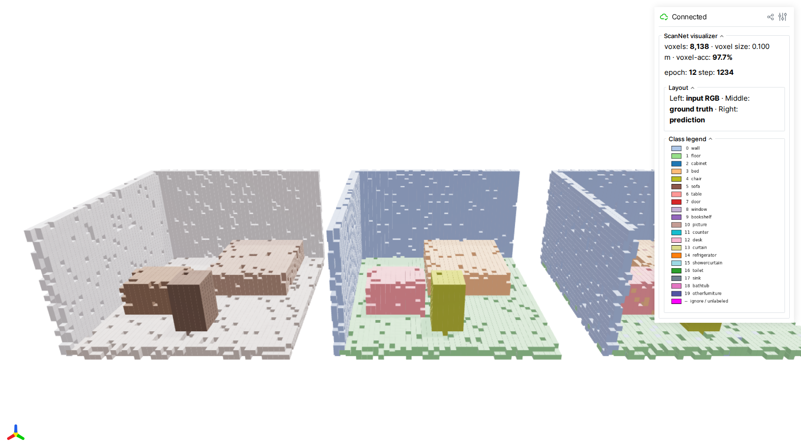
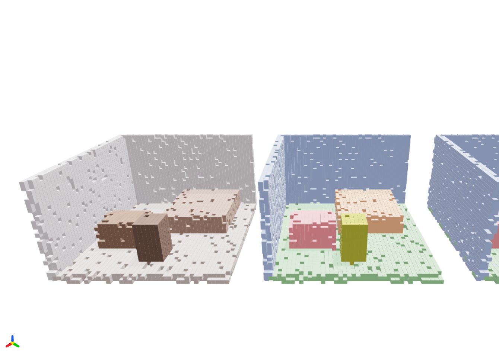
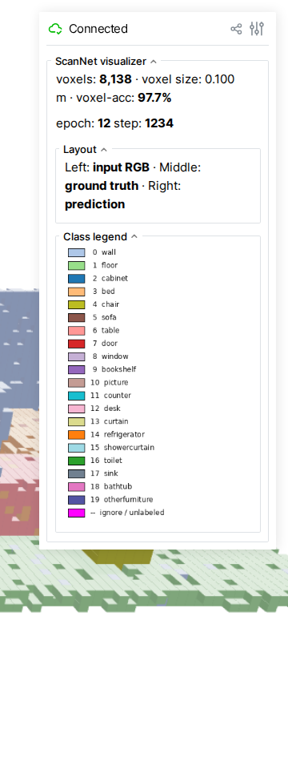

# ScanNet Example

This example trains a semantic segmentation model on
[ScanNet](http://www.scan-net.org/) indoor scenes using a MinkUNet-style
encoder-decoder built with sparse convolutions.

## Dataset

The script uses the pre-processed ScanNet 3D point clouds from the
[OpenScene](https://pengsongyou.github.io/openscene) project. Each scene is
stored as `(coords, colors, labels)`:

- **coords**: `(N, 3)` float32 — 3D point positions
- **colors**: `(N, 3)` float32 — RGB color features
- **labels**: `(N,)` int — semantic class labels (20 classes, 255 = ignore)

The 20 semantic classes include: wall, floor, cabinet, bed, chair, sofa,
table, door, window, bookshelf, picture, counter, desk, curtain, refrigerator,
shower curtain, toilet, sink, bathtub, and other furniture.

The dataset is downloaded automatically on first run (~1.3 GB) to
`./data/scannet_3d/`.

!!! info "Data augmentations are opt-in"
Augmentations are **disabled by default** so the script stays minimal.
Set `data.augmentations=true` to apply the standard ScanNet recipe
(random rotation around the up-axis, scale, horizontal flip, point
dropout, chromatic auto-contrast / translation / jitter / drop).
Expect a **5–10 mIoU boost** over the un-augmented baseline.

## Network architecture

The default model is **MinkUNet18**, a U-Net with sparse convolution
encoder and decoder blocks connected by skip connections. Available models:

| Model                   | Description                 |
| ----------------------- | --------------------------- |
| `mink_unet.MinkUNet18`  | Lightweight U-Net (default) |
| `mink_unet.MinkUNet34`  | Deeper encoder              |
| `mink_unet.MinkUNet50`  | ResNet-50 style blocks      |
| `mink_unet.MinkUNet101` | ResNet-101 style blocks     |

Input points are voxelized at `voxel_size=0.02` and wrapped via
`PointToSparseWrapper`, which handles the point-to-voxel conversion and
maps output features back to the original point resolution.

The model outputs per-point logits with shape `(N, 20)`.

## Setup

Install the optional model and training dependencies:

```bash
pip install "warpconvnet[models]"
```

Additional requirements: `hydra-core`, `omegaconf`, `torchmetrics`.

## Run

```bash
python examples/scannet.py
```

The script uses [Hydra](https://hydra.cc/) for configuration. Override any
parameter on the command line:

```bash
# Smaller batch size for limited GPU memory
python examples/scannet.py train.batch_size=4

# Use a deeper model
python examples/scannet.py model._target_=mink_unet.MinkUNet34

# Change voxel size and learning rate
python examples/scannet.py data.voxel_size=0.05 train.lr=0.01
```

### Configuration reference

**Paths:**

| Key                | Default             | Description                    |
| ------------------ | ------------------- | ------------------------------ |
| `paths.data_dir`   | `./data/scannet_3d` | Dataset directory              |
| `paths.output_dir` | `./results/`        | Output directory               |
| `paths.ckpt_path`  | `null`              | Checkpoint path to resume from |

**Training:**

| Key                 | Default      | Description                                               |
| ------------------- | ------------ | --------------------------------------------------------- |
| `train.batch_size`  | `12`         | Training batch size                                       |
| `train.lr`          | `0.001`      | AdamW learning rate                                       |
| `train.epochs`      | `100`        | Number of training epochs                                 |
| `train.step_size`   | `20`         | StepLR decay period (epochs)                              |
| `train.gamma`       | `0.7`        | StepLR decay factor                                       |
| `train.num_workers` | `8`          | DataLoader workers                                        |
| `train.precision`   | `"16-mixed"` | `"32"` (fp32) or `"16-mixed"` (fp16 forward + GradScaler) |

**Test:**

| Key                | Default | Description        |
| ------------------ | ------- | ------------------ |
| `test.batch_size`  | `12`    | Test batch size    |
| `test.num_workers` | `4`     | DataLoader workers |

**Data:**

| Key                  | Default | Description                               |
| -------------------- | ------- | ----------------------------------------- |
| `data.num_classes`   | `20`    | Number of semantic classes                |
| `data.voxel_size`    | `0.02`  | Voxelization resolution (meters)          |
| `data.ignore_index`  | `255`   | Label index to ignore in loss/metrics     |
| `data.augmentations` | `false` | Apply geometric + chromatic training augs |

**Model:**

| Key                  | Default                | Description                                                  |
| -------------------- | ---------------------- | ------------------------------------------------------------ |
| `model._target_`     | `mink_unet.MinkUNet18` | Model class to instantiate                                   |
| `model.in_channels`  | `3`                    | Input feature channels (RGB)                                 |
| `model.out_channels` | `20`                   | Output channels (num classes)                                |
| `model.in_type`      | `voxel`                | Input type (`voxel` wraps model with `PointToSparseWrapper`) |

**General:**

| Key         | Default | Description                     |
| ----------- | ------- | ------------------------------- |
| `device`    | `cuda`  | Device                          |
| `use_wandb` | `false` | Enable Weights & Biases logging |
| `seed`      | `42`    | Random seed                     |

**Visualization (viser):**

| Key                    | Default | Description                                             |
| ---------------------- | ------- | ------------------------------------------------------- |
| `viz.enabled`          | `false` | Spin up a viser server during training                  |
| `viz.port`             | `8080`  | Viser HTTP port                                         |
| `viz.interval_seconds` | `10.0`  | Min seconds between scene refreshes (per training loop) |

## Data augmentations

Set `data.augmentations=true` to wrap the training dataset with
[`AugmentedScanNetDataset`](https://github.com/nvlabs/warpconvnet/blob/main/examples/scannet_augmentations.py).
The default recipe is a port of the SpatioTemporalSegmentation recipe
([chrischoy/SpatioTemporalSegmentation](https://github.com/chrischoy/SpatioTemporalSegmentation)),
applied **per training sample**, before voxelization:

| Transform                                  | Probability | Range / parameters                                    |
| ------------------------------------------ | ----------- | ----------------------------------------------------- |
| `RandomRotation3D()`                       | always      | x: ±π/64, y: ±π/64, z: ±π (matches upstream)          |
| `RandomScale((0.9,1.1))`                   | always      | uniform scale factor                                  |
| `RandomHorizontalFlip(z)`                  | 0.95        | independent flip per non-up axis                      |
| `RandomTranslationRatio()`                 | always      | ±20 % of scene extent on x/y, none on z               |
| `ElasticDistortion(((0.2,0.4),(0.8,1.6)))` | 0.95        | two-pass smooth coord warp; mean displacement ≈ 27 cm |
| `RandomDropout(0.20)`                      | 0.20        | drop 20 % of points                                   |
| `ChromaticAutoContrast`                    | 0.20        | per-scene auto-contrast, blended                      |
| `ChromaticTranslation(0.10)`               | 0.95        | scene-wide RGB tint, ±10 % of range                   |
| `ChromaticJitter(σ=0.01)`                  | 0.95        | per-point Gaussian RGB noise                          |
| `ChromaticDrop`                            | 0.20        | replace all RGB with mid-gray                         |

Test-time data is **not** augmented (test loader uses the bare
`ScanNetDataset`).

```bash
# Default minimal training (no augs)
python examples/scannet.py

# Standard augmented recipe (recommended)
python examples/scannet.py data.augmentations=true
```

To customize the pipeline, write your own `Compose([...])` and pass it as
the `transform` argument to `AugmentedScanNetDataset`. See
`examples/scannet_augmentations.py` for the available transform classes.

!!! note "About `ElasticDistortion`"
Needs `scipy` and is the slowest transform in the recipe (~0.4 s per
sample). It produces a smooth random warp of coordinate space — flat
walls bow, chair legs curl. Mean per-point displacement at the upstream
parameters `((0.2, 0.4), (0.8, 1.6))` is ≈ 27 cm with p95 ≈ 41 cm.
Disable by passing your own `Compose([...])` without it if profiling
shows the dataloader is your bottleneck.

!!! note "Skipped from upstream"
`HueSaturationTranslation` (marginal mIoU contribution) is not included
by default. Add it yourself if you want the full upstream recipe.

## Live Minecraft-style visualization (viser)

Set `viz.enabled=true` to launch an embedded
[viser](https://viser.studio/latest/) server while training. The visualizer
renders one scan from each batch as **three side-by-side voxel scenes**:

- **Left** — input RGB (per-voxel mean color)
- **Middle** — ground-truth segmentation (per-voxel majority label)
- **Right** — model prediction (per-voxel majority argmax)

Each occupied voxel is drawn as an axis-aligned cube, giving the scene a
Minecraft-like look that makes the discrete sparse-conv grid structure
obvious. The scene refreshes at most once every `viz.interval_seconds`
seconds so it never stalls the training loop.

```bash
# Train + visualize
python examples/scannet.py viz.enabled=true viz.port=8080 viz.interval_seconds=10
# Open http://localhost:8080
```



The three panels (input · GT · prediction) use the same camera and identical
voxelization, so misclassified voxels jump out as color speckles when the
right panel diverges from the middle one.



The GUI sidebar surfaces live metrics — total occupied voxels, voxel-level
accuracy of the current frame, and the current epoch / step — alongside a
class-color legend matching the standard ScanNet 20-class palette.



!!! note "About these screenshots"
The screenshots above were captured by running the visualizer against a
hand-crafted synthetic mini-room (no GPU, no ScanNet data, no
checkpoint required). Regenerate them with:

````
```bash
pip install viser trimesh playwright
playwright install chromium
python docs/examples/scripts/capture_viser_screenshots.py
```
````

## Expected output

Each epoch prints a progress bar followed by test-set evaluation with
accuracy and mean IoU:

```
Train Epoch: 1 Loss:  2.143: 100%|██████████| 104/104
Test set: Average loss:  1.8234, Accuracy:  42.15%, mIoU:  18.73%
```

After 100 epochs with default settings, expect roughly:

- **Overall accuracy**: ~75-80%
- **mIoU**: ~55-65%

Results will vary with augmentation, model choice, and voxel size. This
example is intended as a starting point, not a benchmark-tuned recipe.
