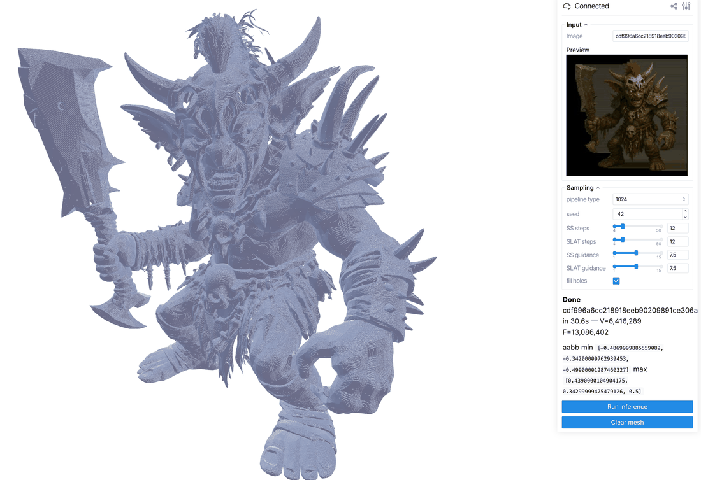

# TRELLIS.2 Viser Visualizer

Use the TRELLIS.2 viser viewer to run image-to-3D inference from a browser and
inspect the generated mesh interactively.



The script lives at
[`examples/inference/trellis2_viser.py`](https://github.com/NVlabs/WarpConvNet/blob/main/examples/inference/trellis2_viser.py).
It loads the TRELLIS.2 image-to-3D pipeline once, then lets you switch input
images, tune sampler settings, run inference, and view the resulting mesh in
the viser scene.

## Setup

Install WarpConvNet with model dependencies, then add the viewer and TRELLIS
runtime dependencies:

```bash
pip install "warpconvnet[models]" viser pillow safetensors huggingface_hub
```

The first run downloads model weights from Hugging Face:

- `microsoft/TRELLIS.2-4B`
- `microsoft/TRELLIS-image-large`

Use a CUDA environment with enough GPU memory for the selected pipeline mode.
Pass `--no_1024` if you only need the 512 mode and want to skip loading the
1024 SLAT flow.

## Run

Launch the viewer with one or more input images:

```bash
python examples/inference/trellis2_viser.py \
    --images /path/to/image1.png /path/to/image2.webp \
    --port 8080
```

Or point it at a directory of images:

```bash
python examples/inference/trellis2_viser.py \
    --image_dir /path/to/images \
    --port 8080
```

For the lighter 512-only path:

```bash
python examples/inference/trellis2_viser.py \
    --image_dir /path/to/images \
    --no_1024
```

Open the printed URL, usually `http://localhost:8080`, in a browser.

## Controls

| Control         | Description                                                  |
| --------------- | ------------------------------------------------------------ |
| `Image`         | Selects one of the input images.                             |
| `pipeline type` | Chooses `512`, `1024`, `1024_cascade`, or `1536_cascade`.    |
| `seed`          | Sets the sampling seed.                                      |
| `SS steps`      | Controls sparse-structure sampler steps.                     |
| `SLAT steps`    | Controls structured-latent sampler steps.                    |
| `SS guidance`   | Sets sparse-structure classifier-free guidance strength.     |
| `SLAT guidance` | Sets structured-latent classifier-free guidance strength.    |
| `fill holes`    | Toggles mesh hole filling in the shape decoder.              |
| `Run inference` | Generates a mesh for the current image and sampler settings. |
| `Clear mesh`    | Removes the displayed mesh from the scene.                   |

Results are cached by image path and sampler settings inside the running
process. Re-running the same configuration redraws the cached mesh instead of
running the pipeline again.
