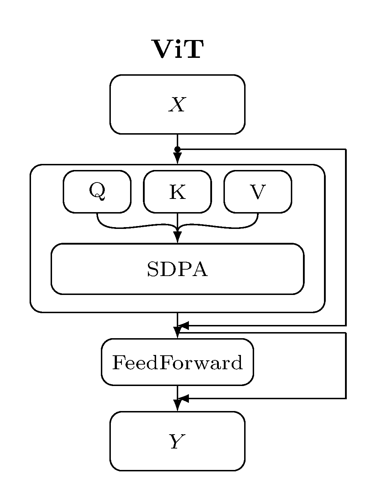
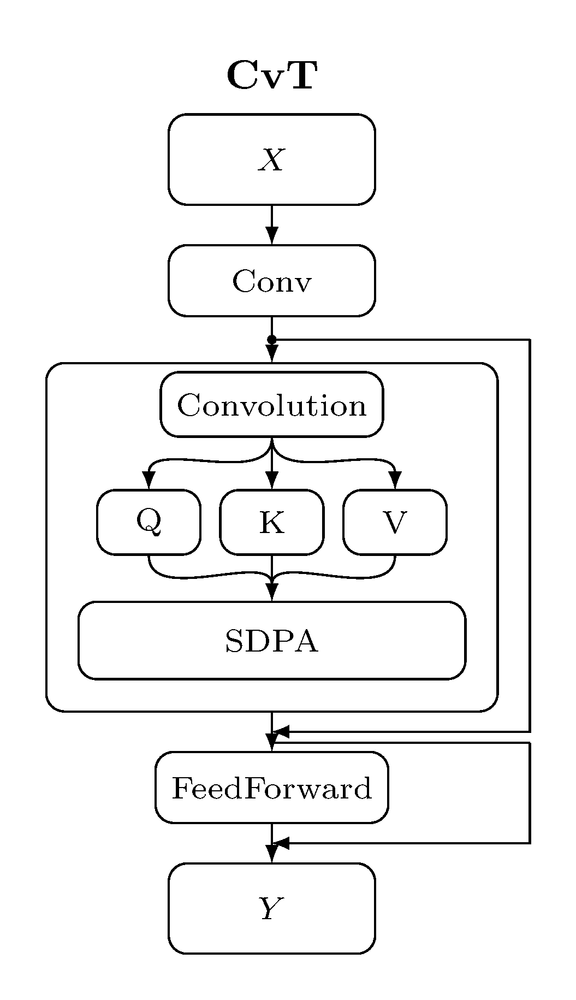
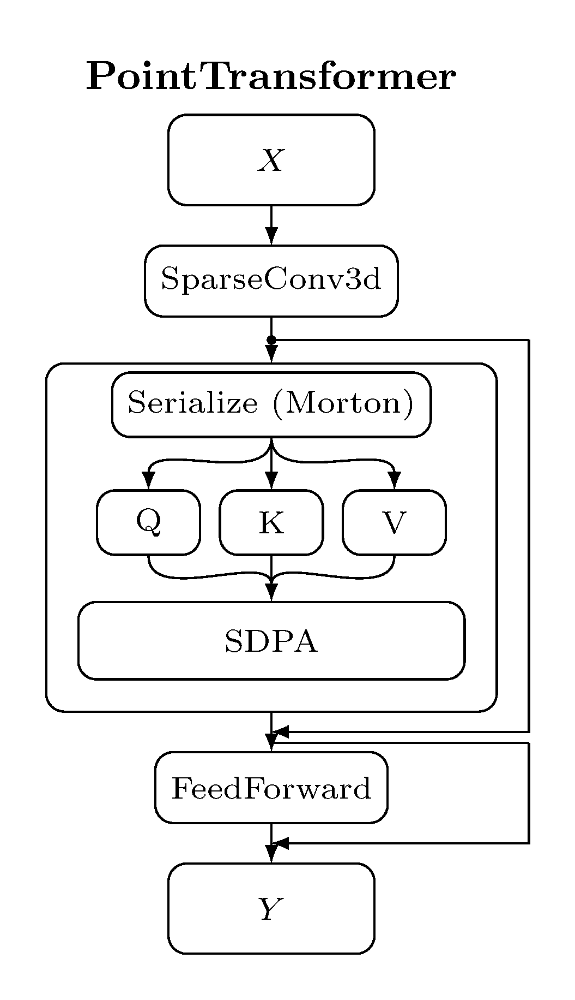
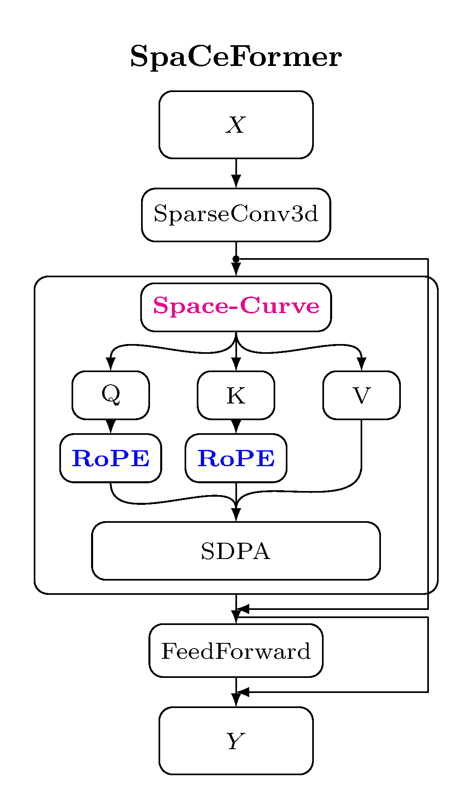
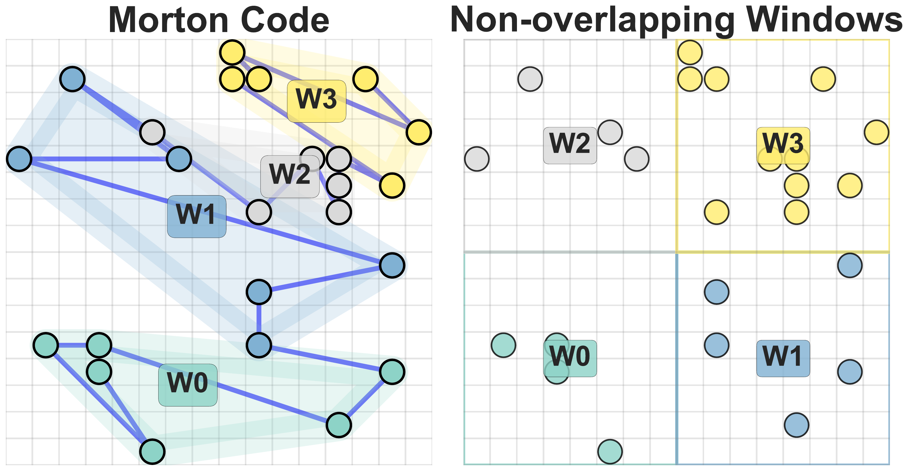

# SpaCeFormer

**Created**: 2026-05-05 13:10:00 PST
**Edited**: 2026-05-05 14:05:00 PST

`warpconvnet.models.SpaCeFormer` is a hierarchical sparse-voxel U-Net whose
attention blocks alternate between two flavors of attention: serialized 1D
attention along a **space**-filling **c**urve, and 3D window-grouped
attention. The name follows the paper's "**spa**ce-**c**urve" etymology.

> Choy, Lee, Park, Cho, Kautz. *SpaCeFormer: Fast Proposal-Free Open-Vocabulary
> 3D Instance Segmentation.* 2026. [Project page](https://nvlabs.github.io/SpaCeFormer/)

## Attention flavors

Each encoder/decoder level picks one of three attention types:

| key     | class                                                                  | what it does                                                                   |
| ------- | ---------------------------------------------------------------------- | ------------------------------------------------------------------------------ |
| `curve` | `PatchAttention` (`warpconvnet.nn.modules.attention`)                  | sort voxels along a space-filling curve, attend within fixed-length 1D patches |
| `space` | `SpaceAttention` (`warpconvnet.nn.modules.space_attention`)            | group voxels into 3D windows of size `window_size`, attend within each window  |
| `all`   | `AllAttention` (subclass of `SpaceAttention` with `window_size="all"`) | full-sequence attention across the level (no window grouping)                  |

Compared to other transformer blocks for vision/3D, the SpaCeFormer block keeps the
sparse-conv shortcut and uses a fused QKV + RoPE path:

| ViT                                         | CvT                                         | PointTransformer                                                      | SpaCeFormer                                                 |
| ------------------------------------------- | ------------------------------------------- | --------------------------------------------------------------------- | ----------------------------------------------------------- |
|  |  |  |  |

The block follows the modern transformer recipe — sparse-conv shortcut,
attention sublayer, feed-forward sublayer — with three norm-residual layouts
to choose from (`pre_norm`, `post_norm`, `stream_norm`). See
[Block layout](#block-layout) below.

### Why curve + space?

The two flavors are complementary, but they make different bargains with
locality.

**Fixed sequence length vs. fixed spatial extent.** Curve attention sorts
voxels along a space-filling curve (Morton / Hilbert / etc.) and chops the
sequence into fixed-length patches of `patch_size` voxels. Two voxels that
are spatial neighbors but happen to straddle a chunk boundary end up in
different attention sets — locality is broken whenever the curve takes a
long jump. Space attention does the opposite: it bins voxels into 3D
windows of a fixed metric extent (`window_size`). Each window holds a
**variable** number of voxels but is guaranteed to contain only spatially
close ones; nothing local is split.

The paper (Sec. 4.3) measures this directly: averaged over a level, the
mean pairwise distance between voxels in the same attention window is
**~28.6% smaller** for space attention than for Morton-curve attention.
Lower intra-window distance ⇒ stronger preservation of local geometric
structure.



**Rule of thumb**: use `space` at the **lower (shallow, high-resolution)**
levels and `curve` at the **higher (deep, low-resolution)** levels. At
shallow stages each voxel covers a small physical region, so the locality
penalty of curve attention hurts; the fixed-extent windows of `space`
keep neighbors together. At deep stages voxels are coarse and the
receptive field is already large; curve attention's long-range
serialization is the cheaper way to move information.

## Block layout

Three norm-residual layouts are exposed via `block_type`:

| name                                                             | math                                     |
| ---------------------------------------------------------------- | ---------------------------------------- |
| `pre_norm` (default, modern transformer convention)              | `x + sublayer(norm(x))`                  |
| `post_norm`                                                      | `attn(x) + x; norm; mlp(x) + x; norm`    |
| `stream_norm` (paper's choice, residual stream stays normalized) | `norm(x); sublayer(x) + x; norm(x); ...` |

All three live in `warpconvnet.nn.modules.space_attention` and are reusable
in other transformer-based backbones via `block_factory(name)` /
`BLOCK_REGISTRY`.

## RoPE

Q/K rotation uses a 3D voxel-coordinate RoPE
(`VoxelRotaryPositionalEmbeddings`). The kernel is fused: a single CUDA pass
loads QKV `[M, 3, C]`, applies the rotation to the first
`(head_dim // 6) * 6` dimensions of Q and K, and writes `[M, 3, num_heads, head_dim]` ready for `flash_attn_varlen_qkvpacked`.

Use `warpconvnet.nn.modules.rope.suggest_voxel_rope_base` to pick a
window-aware base. For a level with window size `L` voxels, the
default `scaled_window` strategy returns `≈4·L` clamped to a power of two.

## Signature

```python
class SpaCeFormer(BaseSpatialModel):
    def __init__(
        self,
        in_channels: int = 6,
        enc_depths: Tuple[int, ...] = (2, 2, 2, 6, 2),
        enc_channels: Tuple[int, ...] = (32, 64, 128, 256, 512),
        enc_num_head: Tuple[int, ...] = (2, 4, 8, 16, 32),
        enc_patch_size: Tuple[int, ...] = (1024,) * 5,
        enc_attn_types: str | List[str] = "curve",   # 'c'/'s'/'a' compact code OK
        dec_depths: Tuple[int, ...] = (2, 2, 2, 2),
        dec_channels: Tuple[int, ...] = (64, 64, 128, 256),
        dec_num_head: Tuple[int, ...] = (4, 4, 8, 16),
        dec_patch_size: Tuple[int, ...] = (1024,) * 4,
        dec_attn_types: str | List[str] = "curve",
        block_type: Literal["pre_norm", "post_norm", "stream_norm"] = "pre_norm",
        use_rope: bool = False,
        rope_base: int | None = None,                # overrides per-level lists
        enc_rope_bases: Tuple[int, ...] = (250,) * 5,
        dec_rope_bases: Tuple[int, ...] = (250,) * 4,
        out_channels: int | None = None,
        # ... see source for full signature
    ): ...
    def forward(self, x: Voxels) -> Voxels: ...
```

`enc_attn_types` and `dec_attn_types` accept three forms:

- a single string (`"curve"` / `"space"` / `"all"`) — broadcast to all levels.
- a compact code (`"ccssa"` for 5 levels) — one character per level via
  `{"c": "curve", "s": "space", "a": "all"}`.
- an explicit list of attention names.

## Usage

```python
import torch
from warpconvnet.geometry.types.points import Points
from warpconvnet.geometry.types.conversion.to_voxels import points_to_voxels
from warpconvnet.models import SpaCeFormer

device = "cuda"

# A toy point cloud.
B, C = 2, 6
coords = [torch.rand(8000, 3) for _ in range(B)]
features = [torch.rand(8000, C) for _ in range(B)]
pc = Points(coords, features).to(device)
voxels = points_to_voxels(pc, voxel_size=0.02)

model = SpaCeFormer(
    in_channels=C,
    enc_depths=(2, 2, 2, 6, 2),
    enc_channels=(32, 64, 128, 256, 512),
    enc_num_head=(2, 4, 8, 16, 32),
    enc_patch_size=(32, 32, 1024, 1024, 1024),
    enc_attn_types="ssccc",            # space at shallow levels, curve deeper
    dec_depths=(2, 2, 2, 2),
    dec_channels=(64, 64, 128, 256),
    dec_num_head=(4, 4, 8, 16),
    dec_patch_size=(32, 32, 1024, 1024),
    dec_attn_types="ssca",             # space at shallow, curve deeper, 'all' at the bottleneck
    block_type="pre_norm",
    use_rope=True,
    out_channels=20,
).to(device)

out = model(voxels)                    # Voxels with .feature_tensor of shape (M, 20)
```

## Pipeline

The backbone produces dense per-voxel features. For instance/mask
prediction, plug it into `MaskFormer`:

```python
from warpconvnet.models import MaskFormer
from warpconvnet.nn.modules.sparse_pool import PointToVoxel

backbone = PointToVoxel(
    inner_module=SpaCeFormer(in_channels=3, out_channels=96, ...),
    voxel_size=0.04,
    concat_unpooled_pc=False,
)
model = MaskFormer(backbone=backbone, hidden_dim=96, ...)
```

See [MaskFormer](maskformer.md) for the head and [ScanNet](../examples/scannet.md)
for the dataset wiring.

## Reference

- Choy, Lee, Park, Cho, Kautz. *SpaCeFormer: Fast Proposal-Free
  Open-Vocabulary 3D Instance Segmentation.* 2026.
- [Project page](https://nvlabs.github.io/SpaCeFormer/) — qualitative
  results, paper PDF.
- [Author blog post](https://chrischoy.org/posts/spaceformer/) — design
  notes on the curve/space mix and RoPE decoder.
