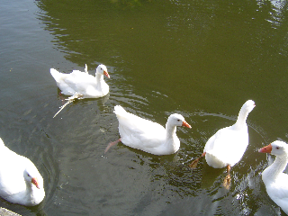
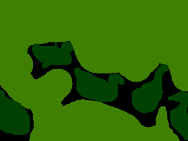
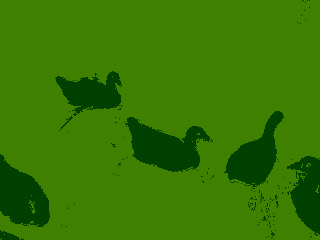

# Dense-CRF Mean-Field as Sparse Convolution

**Created**: 2026-05-03 19:42:26 PST
**Edited**: 2026-05-03 19:42:26 PST

A dense Conditional Random Field (CRF) over image pixels — every pixel
connected to every other pixel — is, at first sight, intractable: with
$N = HW$ pixels and $K$ labels, message passing costs $O(N^2 K)$.
[Krähenbühl & Koltun (2011)](https://arxiv.org/abs/1210.5644) showed
that when the pairwise potential is a Gaussian in some feature space,
mean-field inference reduces to **filtering with that Gaussian** — and
high-dimensional Gaussian filtering reduces to a **sparse convolution
on a lattice in that high-dimensional space**.

This page reproduces their dense-CRF on a 2D image using the same primitives
WarpConvNet uses for 3D and higher. The 5D appearance kernel is the
interesting bit; the 2D smoothness kernel is honest dense `Conv2d`. The
[example](#running-the-example) ships as
[`examples/crf_image_example.py`](https://github.com/nvlabs/warpconvnet/blob/main/examples/crf_image_example.py).

The paper's full trilateral construction (7D, RGB videos) is the same idea
in higher dimension; see [Going higher: 7D trilateral CRF](#going-higher-7d-trilateral-crf).

## Model

Each pixel $i$ has a label $x_i \in \{1, \ldots, K\}$. The Gibbs energy is

$$
E(\mathbf{x}) \;=\; \sum_i \psi_u(x_i) \;+\; \sum_{i < j} \psi_p(x_i, x_j),
$$

with unary $\psi_u(x_i) = -\log P(x_i \mid \text{image})$ from any
per-pixel classifier, and **fully connected** pairwise

$$
\psi_p(x_i, x_j) \;=\; \mu(x_i, x_j) \, k(\mathbf{f}_i, \mathbf{f}_j),
$$

where $\mu$ is a label-compatibility matrix and $k$ is a Gaussian in some
per-pixel feature vector $\mathbf{f}_i$.

Krähenbühl & Koltun use a sum of two Gaussians:

$$
k(\mathbf{f}_i, \mathbf{f}_j)
= w^{(\text{app})} \exp\!\left(
    -\frac{\lVert \mathbf{p}_i - \mathbf{p}_j \rVert^2}{2 \sigma_\alpha^2}
    -\frac{\lVert \mathbf{I}_i - \mathbf{I}_j \rVert^2}{2 \sigma_\beta^2}
\right)
+ w^{(\text{smooth})} \exp\!\left(
    -\frac{\lVert \mathbf{p}_i - \mathbf{p}_j \rVert^2}{2 \sigma_\gamma^2}
\right),
$$

with pixel position $\mathbf{p}_i$ and color $\mathbf{I}_i$. The first
term is **edge-preserving**: pixels far apart in (xy, rgb) get tiny weight,
so labels do not bleed across color edges. The second term is a
**smoothness** prior on (xy) alone, so isolated label-flips in textured
regions are removed regardless of color.

For Potts compatibility $\mu(a, b) = [a \neq b]$, no learnable parameters
are needed.

## Mean-field inference

We approximate the posterior $P(\mathbf{x})$ by a fully factored
$Q(\mathbf{x}) = \prod_i Q_i(x_i)$ and minimize KL divergence. The
update for each $Q_i$ is

$$
Q_i(x_i = l) \;\propto\; \exp\!\left\{
  -\psi_u(x_i = l)
  -\sum_{l' \in \mathcal{L}} \mu(l, l') \sum_{c} w^{(c)} \!\!\!\sum_{j \neq i}\!\! k^{(c)}(\mathbf{f}_i, \mathbf{f}_j) \, Q_j(l')
\right\}.
$$

Reading right to left:

1. **Message passing** — for each kernel $c$ and each label $l'$,
   $\tilde Q^{(c)}_i(l') = \sum_{j \neq i} k^{(c)}(\mathbf{f}_i, \mathbf{f}_j) Q_j(l')$.
   Stack across $l'$: this is a Gaussian filter applied to the $K$-channel
   probability map $Q$, *excluding the self contribution*.
2. **Weighted sum** of kernels: $\tilde Q_i = \sum_c w^{(c)} \tilde Q^{(c)}_i$.
3. **Compatibility transform**: $\hat Q_i(l) = \sum_{l'} \mu(l, l') \tilde Q_i(l')$
   — a $1{\times}1$ convolution across the label dimension. With Potts,
   $\hat Q_i(l) = \tilde Q_i.\mathrm{sum}() - \tilde Q_i(l)$.
4. **Local update**: $Q_i \leftarrow \mathrm{softmax}(-\psi_u - \hat Q)$.

Iterate 5–10 times. The whole loop is differentiable, so one can stack the
mean-field iterations on top of a CNN and train end-to-end
([CRF-as-RNN, Zheng et al. 2015](https://arxiv.org/abs/1502.03240)).

## Filtering as sparse convolution

Step 1 is the only expensive step, and it is exactly what bilateral
filtering hardware was built for. For the appearance kernel, lift each
pixel into 5D:

$$
\mathbf{u}_i \;=\; \bigl(
  x_i / \sigma_\alpha,\; y_i / \sigma_\alpha,\;
  r_i / \sigma_\beta,\; g_i / \sigma_\beta,\; b_i / \sigma_\beta
\bigr) \;\in\; \mathbb{R}^5.
$$

A Gaussian in 5D evaluated on a regular voxel grid would need ~$10^{11}$
cells (e.g., $640{\times}480{\times}256^3$). Conv5d is out of the question.
But only $N = HW$ lattice points are *occupied* — the rest of the volume
is empty. This is the regime where **sparse convolution** wins: the
permutohedral lattice (Adams, Baek, Davis 2010) and $d$-cube voxel sparse
conv both store only occupied vertices, and the splat–blur–slice cost
scales as $O(N \cdot d \cdot K)$ rather than the dense $O(\text{voxels} \cdot K)$.

The 2D smoothness term has $\mathbf{u}_i = (x_i / \sigma_\gamma, y_i / \sigma_\gamma)$.
Pixels are dense in 2D, so a plain `torch.nn.Conv2d` with a fixed Gaussian
weight is the right tool — sparse machinery would buy nothing.

WarpConvNet's relevant building blocks:

| Term       | Lift dim | Operator                            | Module                                      |
| :--------- | :------- | :---------------------------------- | :------------------------------------------ |
| Appearance | 5        | Permutohedral lattice (sparse conv) | `wn.BilateralPermutohedralFilterCached`     |
| Smoothness | 2        | Dense Gaussian conv                 | `torch.nn.Conv2d` (fixed weight, depthwise) |

For depth $d \le 6$, the permutohedral path is fastest. Above $d = 6$ or
when one wants explicit voxel coordinates, the same logic carries over to
[`SpatiallySparseConv(num_spatial_dims=d)`](sparse_convolutions.md) with a
fixed Gaussian weight.

## Algorithm

```text
Inputs: image I (HxWx3), unary U (NxK), kernel weights w_a, w_s,
        bandwidths sigma_alpha, sigma_beta, sigma_gamma.

# 1. build the 5D appearance lattice once
appearance = BilateralPermutohedralFilterCached(sigma_alpha, sigma_beta)
appearance.build_lattice(xy, rgb)        # 5D lift, splat structure cached

# 2. fixed-weight depthwise Gaussian for smoothness (dense Conv2d)
smooth_weight = gauss_2d(sigma_gamma)    # zero center -> excludes self

# 3. mean-field
Q = softmax(-U)
for t in range(T):
    Q_app = appearance(Q) - Q            # subtract self -> j != i
    Q_sm  = depthwise_conv2d(Q, smooth_weight)
    msg   = w_a * Q_app + w_s * Q_sm
    compat = msg.sum(-1, keepdim=True) - msg     # Potts mu @ msg
    Q     = softmax(-U - compat)
return Q
```

The two filtering ops are the same kind of operator at different
dimensions: the 5D one wins by being sparse, the 2D one is plain dense.

## Running the example

```bash
python examples/crf_image_example.py --out-dir docs/user_guide/img
```

The script fetches the densecrf reference image (`im1.png`) and noisy
annotation (`anno1.png`) from
[`lucasb-eyer/pydensecrf`](https://github.com/lucasb-eyer/pydensecrf)
on first run, then runs 5 mean-field iterations and writes:

- `crf_input_image.png` — RGB input
- `crf_input_anno.png` — noisy per-pixel labels (the unary)
- `crf_refined_anno.png` — labels after mean-field

|            Image             |         Noisy unary         |         After 5 iters         |
| :--------------------------: | :-------------------------: | :---------------------------: |
|  |  |  |

In the densecrf reference annotation, pure black (0, 0, 0) marks pixels
where no class is asserted; every other unique RGB triplet is one class.
The unary follows the densecrf convention: labeled pixels get the
assigned class with probability `gt_prob = 0.7` and split the remaining
mass equally; black ("unknown") pixels get a uniform prior. Mean-field
then propagates labels into the unknown regions guided by image edges.

## Going higher: 7D trilateral CRF

The 5D bilateral CRF generalizes to RGB **video** by adding a time axis
to position. [Choy, Gwak, & Savarese (CVPR 2019)](https://arxiv.org/abs/1904.08755)
("4D Spatio-Temporal ConvNets: Minkowski Convolutional Neural Networks")
introduce a **trilateral-stationary CRF** for 4D video segmentation in
their §5: lift each voxel into

$$
\mathbf{u}_i \;=\; \bigl(
  x_i / \sigma_x,\; y_i / \sigma_y,\; z_i / \sigma_z,\; t_i / \sigma_t,\;
  r_i / \sigma_r,\; g_i / \sigma_g,\; b_i / \sigma_b
\bigr) \;\in\; \mathbb{R}^7,
$$

and run the same mean-field algorithm with sparse convolution on the 7D
lattice. The dense version of this would touch $\gtrsim 10^{15}$ cells;
only the occupied voxels matter, so the sparse-convolution machinery is
not just an optimization but the *only* tractable path. The compatibility
matrix $\mu$ is learned (1×1 conv across labels), and the kernel and
weights are trained jointly with the backbone — i.e., the entire CRF is a
differentiable head.

The 2D example here is the same algorithm at $d = 5$ instead of $d = 7$,
with Potts compatibility instead of a learned $\mu$. The pattern transfers:
the higher the dimension, the more sparse convolution earns its keep.

## References

- Krähenbühl, Koltun. *Efficient Inference in Fully Connected CRFs with
  Gaussian Edge Potentials.* NeurIPS 2011.
  [arXiv:1210.5644](https://arxiv.org/abs/1210.5644).
- Adams, Baek, Davis. *Fast High-Dimensional Filtering Using the
  Permutohedral Lattice.* Eurographics 2010.
- Zheng et al. *Conditional Random Fields as Recurrent Neural Networks.*
  ICCV 2015. [arXiv:1502.03240](https://arxiv.org/abs/1502.03240).
- Choy, Gwak, Savarese. *4D Spatio-Temporal ConvNets: Minkowski
  Convolutional Neural Networks.* CVPR 2019, §5 trilateral CRF.
  [arXiv:1904.08755](https://arxiv.org/abs/1904.08755).
- See also [Bilateral and Permutohedral Filters](bilateral_permutohedral_filters.md)
  for the underlying filter primitives.
