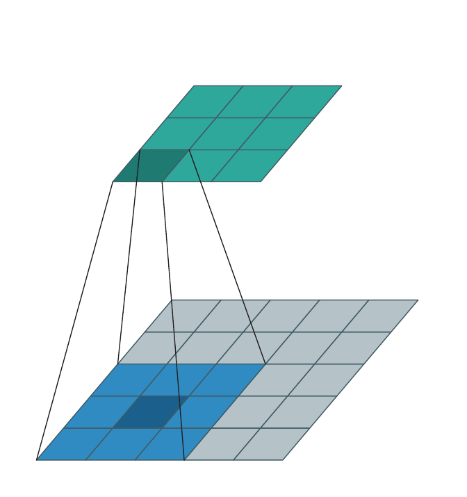
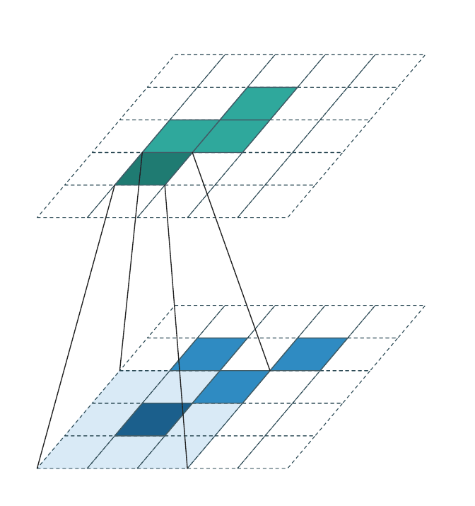
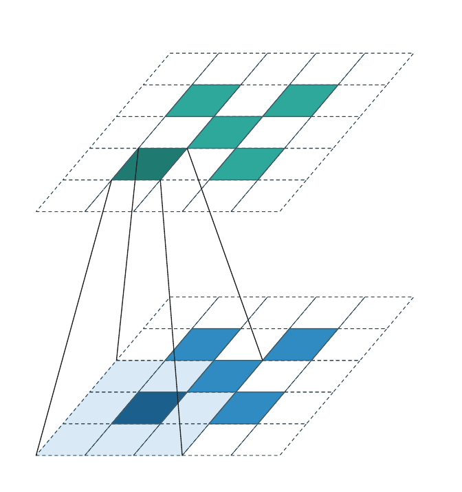
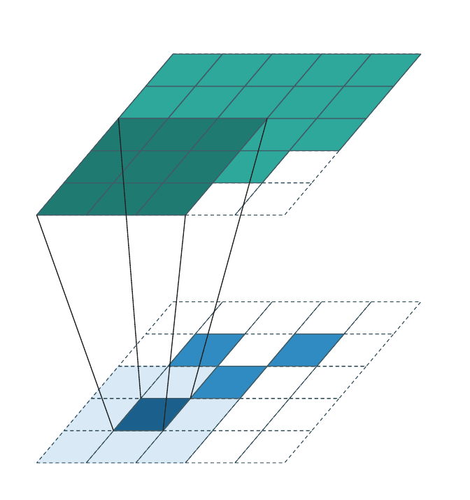
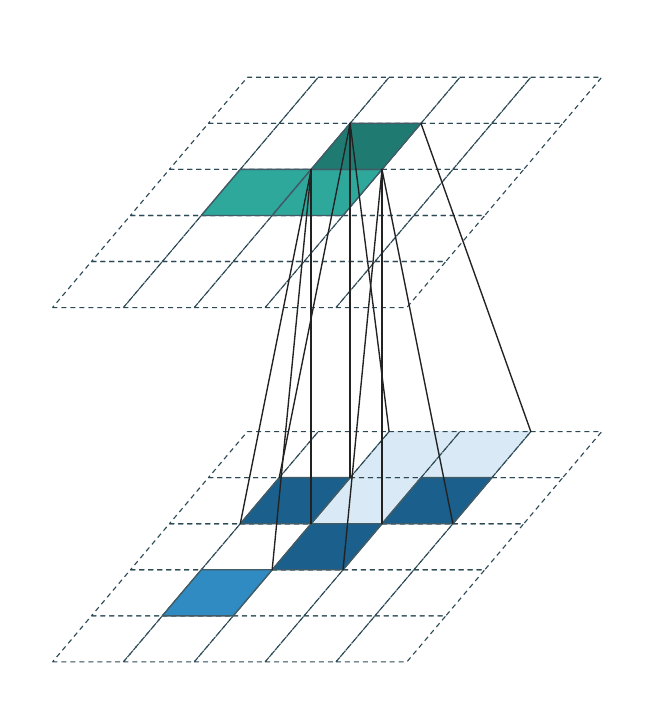

# Spatially Sparse Convolutions

**Created**: 2026-04-18 17:02:44 PST
**Edited**: 2026-05-03 19:15:00 PST

WarpConvNet implements **spatially sparse convolutions** on integer-grid
voxel coordinates. This page is the conceptual entry point: what
"spatially sparse" means, the mathematical definition, and visualizations
of the four convolution regimes WarpConvNet supports.

For the user-facing API (layer constructors, kernel sizes, group / depthwise
variants, generative decoders), see
[Variants & API](sparse_convolutions_variants.md). For the GEMM-level
implementation (AB/ABt/AtB ops, kernel-map structures, algorithm picking),
see [Internals](sparse_convolutions_internals.md).

## Spatial vs. feature vs. weight sparsity

"Sparsity" in neural networks is overloaded. Three distinct flavors show
up in 3D work and they have completely different implications:

| Kind                 | What is sparse                                                             | Typical source                                                   | How WarpConvNet handles it                                                         |
| -------------------- | -------------------------------------------------------------------------- | ---------------------------------------------------------------- | ---------------------------------------------------------------------------------- |
| **Spatial sparsity** | Most grid coordinates are empty; only occupied coordinates carry features. | Native to 3D point clouds, LiDAR, voxel grids, occupancy fields. | Primary target. All convolutions on `Voxels` operate only on occupied coordinates. |
| **Feature sparsity** | Individual feature-channel values are zero (e.g. post-ReLU).               | Activation sparsity, gated MoE, quantization.                    | Orthogonal; not exploited by the conv kernels here.                                |
| **Weight sparsity**  | Pruned kernel weights are structurally zero.                               | Pruning for model compression.                                   | Orthogonal; compatible but not exploited.                                          |

The distinction between *spatial* and *weight* sparsity (and the motivation
to study them jointly) is the subject of [1]. This page is about **spatial
sparsity** — only the first row of the table.

## Mathematical definition

### Domain

Fix a spatial dimension $D \in \{2, 3\}$ (sometimes 4 with a temporal
axis). The convolution operates on the integer grid $\mathbb{Z}^D$.
Coordinates are written as bold lowercase, $\mathbf{u} = (u_1, \ldots, u_D) \in \mathbb{Z}^D$.

### Coordinate sets

A *spatially sparse tensor* is a pair

$$
\bigl(\mathcal{C},\ \{\mathbf{x}_{\mathbf{u}}\}_{\mathbf{u} \in \mathcal{C}}\bigr),
\qquad
\mathcal{C} \subset \mathbb{Z}^D,
\quad
\mathbf{x}_{\mathbf{u}} \in \mathbb{R}^{C}.
$$

$\mathcal{C}$ is the **coordinate set** (the explicitly stored, *occupied*
voxels) and $\mathbf{x}_{\mathbf{u}}$ is the per-coordinate feature
vector of width $C$. Only $|\mathcal{C}| \ll |\mathbb{Z}^D|$ coordinates
are materialized; everywhere else the tensor is *implicitly* zero.

### Kernel offsets

A convolution kernel of (odd) size $K$ in each axis is identified with
its **offset set**

$$
\mathcal{K} \;=\; \Bigl\{\, \mathbf{i} \in \mathbb{Z}^D : -\lfloor K/2 \rfloor \le i_d \le \lfloor K/2 \rfloor \;\text{for all } d \,\Bigr\},
\qquad
|\mathcal{K}| = K^D.
$$

For $D=3$ and $K=3$ this is the familiar $3{\times}3{\times}3$ box of
27 offsets. WarpConvNet also supports arbitrary offset sets
$\mathcal{K} \subset \mathbb{Z}^D$ (no requirement to be a box).

### Generalized sparse convolution

Given an input tensor on $\mathcal{C}^{\text{in}}$, an output coordinate
set $\mathcal{C}^{\text{out}} \subset \mathbb{Z}^D$, an offset set
$\mathcal{K}$, and per-offset weight matrices $\mathbf{W}_{\mathbf{i}} \in \mathbb{R}^{C_{\text{out}} \times C_{\text{in}}}$
for $\mathbf{i} \in \mathcal{K}$, the **generalized sparse convolution** [2] is

$$
\boxed{\;
\mathbf{y}_{\mathbf{u}} \;=\; \sum_{\mathbf{i} \in \mathcal{N}(\mathbf{u},\,\mathcal{K},\,\mathcal{C}^{\text{in}})} \mathbf{W}_{\mathbf{i}}\, \mathbf{x}_{\mathbf{u} + \mathbf{i}}
\quad \text{for every } \mathbf{u} \in \mathcal{C}^{\text{out}},
\;}
$$

where the **active-offset set** at output coordinate $\mathbf{u}$ is

$$
\mathcal{N}(\mathbf{u},\,\mathcal{K},\,\mathcal{C}^{\text{in}}) \;=\; \bigl\{\, \mathbf{i} \in \mathcal{K} : \mathbf{u} + \mathbf{i} \in \mathcal{C}^{\text{in}} \,\bigr\}.
$$

That is: for each output coordinate $\mathbf{u}$, only the kernel offsets
that land on an *occupied* input coordinate contribute to the sum.

### Cost

The total work is proportional to the number of occupied
**(input, output, offset)** triples:

$$
T \;=\; \sum_{\mathbf{u} \in \mathcal{C}^{\text{out}}} \bigl|\,\mathcal{N}(\mathbf{u},\,\mathcal{K},\,\mathcal{C}^{\text{in}})\,\bigr| \;\cdot\; C_{\text{in}} \cdot C_{\text{out}}.
$$

Compare to dense convolution, where work is
$|\mathbb{Z}^D \cap \text{volume}| \cdot |\mathcal{K}| \cdot C_{\text{in}} \cdot C_{\text{out}}$ — independent
of how many cells are actually occupied. **Spatial sparsity replaces
"volume" with "occupied neighbor pairs"**, which is the entire point.

## The four regimes — visual

Three flags on `SparseConv3d` / `spatially_sparse_conv` — `stride`,
`transposed`, `generative` — together with whether the input is dense
or sparse, give rise to the regimes below. (Animations illustrate the
2D case for visual clarity; the 3D case is identical with one extra axis.)

### Dense input → dense output

The classical case: $\mathcal{C}^{\text{in}}$ and $\mathcal{C}^{\text{out}}$
are both *every* cell in some bounding box, and $\mathcal{N}(\mathbf{u}, \mathcal{K}, \mathcal{C}^{\text{in}}) = \mathcal{K}$
at every interior $\mathbf{u}$. The animation below sweeps the kernel over a
$3{\times}3$ output, pulling a $3{\times}3$ patch from the dense input each
step.

This is what `torch.nn.Conv3d` does. WarpConvNet handles it correctly but
gains nothing over a dense backend in this regime — there is no spatial
sparsity to exploit.

### Sparse input → sparse output (stride > 1, downsampling)

$\mathcal{C}^{\text{in}}$ is sparse (only a few occupied voxels). When
`stride > 1`, $\mathcal{C}^{\text{out}}$ is the downsampled image of
$\mathcal{C}^{\text{in}}$:

$$
\mathcal{C}^{\text{out}} \;=\; \bigl\{\, \mathbf{u} \in \mathbb{Z}^D : \mathbf{u} = \lfloor \mathbf{v} / s \rfloor \text{ for some } \mathbf{v} \in \mathcal{C}^{\text{in}} \,\bigr\}.
$$

The frustum lines show the $3{\times}3$ kernel reach for the focused
output cell. Most cells inside the kernel reach are *empty* (dashed
scaffold) — the active-offset set $\mathcal{N}(\mathbf{u}, \mathcal{K}, \mathcal{C}^{\text{in}})$
is much smaller than $|\mathcal{K}|$ in practice.

### Stride = 1 (coordinate-preserving)

Special case of the above with stride 1 and `generative=False`:

$$
\mathcal{C}^{\text{out}} \;=\; \mathcal{C}^{\text{in}}.
$$

Every input coordinate produces an output at the same coordinate; no new
sites are introduced and no sites are dropped. This is what
Graham & van der Maaten introduced as *submanifold sparse convolution*
[3]. WarpConvNet uses the stride-based name (`SparseConv3d(stride=1)`).

The output cell sits *directly above* its input twin. Kernel offsets
that land on empty input cells contribute nothing. This is the workhorse
inside sparse U-Net trunks: it preserves the occupied set across many
layers, so spatial sparsity does not erode with depth.

### Generative convolution

Generative convolution is the only regime that *adds* new coordinates.
$\mathcal{C}^{\text{out}}$ is constructed by expanding every input
coordinate $\mathbf{u} \in \mathcal{C}^{\text{in}}$ through the kernel:

$$
\mathcal{C}^{\text{out}} \;=\;
\bigcup_{\mathbf{u} \in \mathcal{C}^{\text{in}}}
\bigl\{\, \mathbf{u} + \mathbf{i} : \mathbf{i} \in \mathcal{K} \,\bigr\}.
$$

The weight matrices are applied **transposed** relative to the forward
direction (each output coordinate accumulates contributions from all input
coordinates whose kernel reach covers it). Each animation frame highlights
one input voxel and the output coordinates it generates (dark teal); output
coordinates generated by other input voxels are shown in lighter teal.

Successive generative layers progressively fill the occupied region and are
the standard tool for sparse generative decoders and diffusion models.

### Generalized convolution

$\mathcal{K}$ need not be a box, and $\mathcal{C}^{\text{out}}$ need not
be derived from $\mathcal{C}^{\text{in}}$ by stride or generative
expansion. The most general form takes both as user-specified sets:

$$
\bigl(\,\mathcal{C}^{\text{in}},\ \mathcal{C}^{\text{out}},\ \mathcal{K}\,\bigr) \;\text{arbitrary}.
$$

WarpConvNet uses this internally for transposed convolutions and for
cross-attention-style custom kernel maps.

## How $\mathcal{C}^{\text{out}}$ is chosen

Summary table — full details and code examples in [Variants & API](sparse_convolutions_variants.md).

| Regime                    | Flags                         | $\mathcal{C}^{\text{out}}$                                   | Animation                                    |
| ------------------------- | ----------------------------- | ------------------------------------------------------------ | -------------------------------------------- |
| **stride=1**              | `stride=1`                    | $\mathcal{C}^{\text{in}}$                                    | [stride1](img/sparse_conv_stride1.gif)       |
| **Downsampling**          | `stride>1`                    | Downsampled coordinates (one per stride cell)                | [sparse](img/sparse_conv_sparse.gif)         |
| **Generative (stride=1)** | `generative=True`, `stride=1` | $\mathcal{C}^{\text{in}}$ **expanded by the kernel support** | [generative](img/sparse_conv_generative.gif) |
| **Generative (stride>1)** | `generative=True`, `stride>1` | Stride first, then expand                                    | (generalized form)                           |
| **Transposed**            | `transposed=True`, `stride>1` | Upsampled coordinates by factor `stride`                     | (generalized form)                           |

## See also

- [Variants & API](sparse_convolutions_variants.md) — `SparseConv3d`,
  group / depthwise variants, generative decoders, usage examples.
- [Internals](sparse_convolutions_internals.md) — the three math kernels
  per layer (AB / ABt / AtB), algorithm taxonomy, source files.
- [Auto-Tuning](autotune.md) — per-shape algorithm selection and caching.
- [Bilateral & Permutohedral Filters](bilateral_permutohedral_filters.md)
  — sparse convolution lifted to high-dimensional lattices.

## References

1. Lee, J., Choy, C., Park, J. *Putting 3D Spatially Sparse Networks on a Diet.* arXiv:2112.01316, 2021. [[arxiv]](https://arxiv.org/abs/2112.01316)
2. Choy, C., Gwak, J., Savarese, S. *4D Spatio-Temporal ConvNets: Minkowski Convolutional Neural Networks.* CVPR 2019. arXiv:1904.08755. [[arxiv]](https://arxiv.org/abs/1904.08755)
3. Graham, B., van der Maaten, L. *Submanifold Sparse Convolutional Networks.* arXiv:1706.01307, 2017. [[arxiv]](https://arxiv.org/abs/1706.01307)
   See also Graham, Engelcke, van der Maaten. *3D Semantic Segmentation with Submanifold Sparse Convolutional Networks.* CVPR 2018. arXiv:1711.10275. [[arxiv]](https://arxiv.org/abs/1711.10275)
