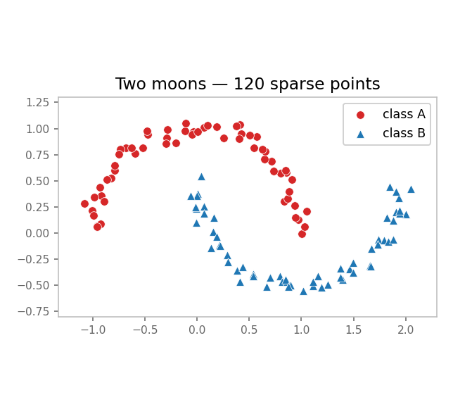
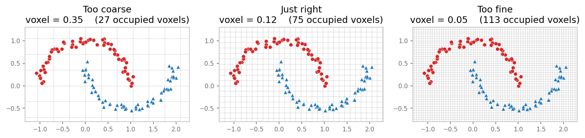
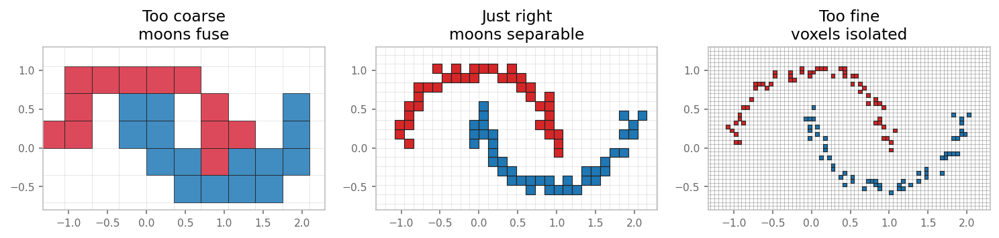
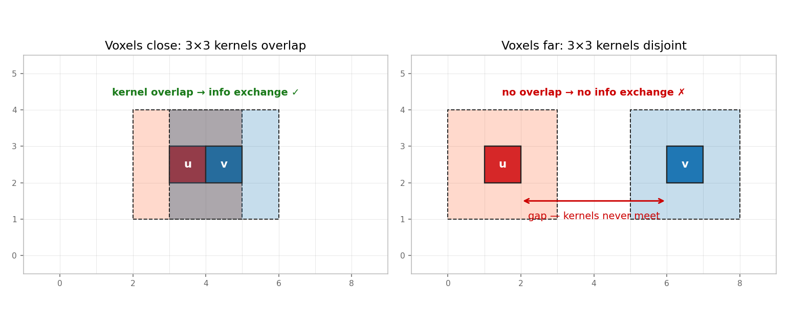
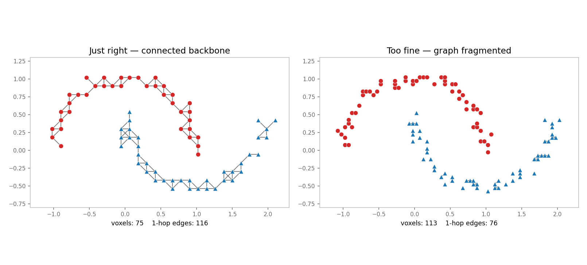
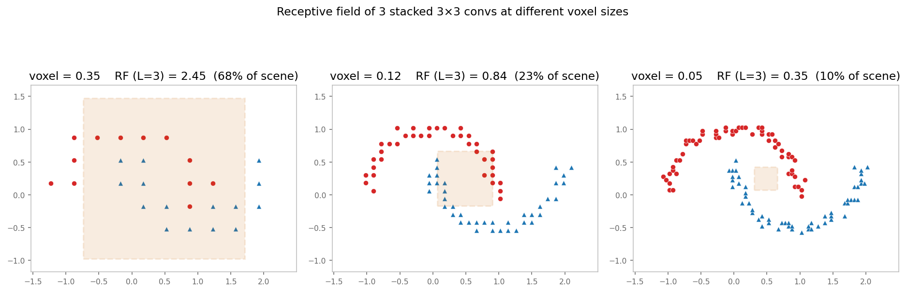

<!--
created: 2026-05-02 22:55:00
edited:  2026-05-02 23:10:00
-->

# Voxel Size Caveats: Detail Loss vs. Point Continuity

Spatially sparse convolutions only see what falls into a voxel cell, and only
exchange information with neighbors covered by the kernel footprint.
Voxel size sits at the heart of both of those constraints, so the choice has
two failure modes that pull in opposite directions:

| Voxel too **large**                                                                               | Voxel too **small**                                                                                                                   |
| ------------------------------------------------------------------------------------------------- | ------------------------------------------------------------------------------------------------------------------------------------- |
| Distinct geometry collapses into the same cell. Detail destroyed before the network ever sees it. | Most cells contain ≤1 point, neighbors no longer fall inside each other's kernel footprint. Convolutions stop exchanging information. |

This page uses a 2-D **two-moons** toy dataset to make both failure modes
visible. The same intuitions transfer directly to 3-D point clouds.

> All figures are generated by
> [`docs/user_guide/scripts/voxel_size_caveats_figures.py`](https://github.com/nvlabs/warpconvnet/blob/main/docs/user_guide/scripts/voxel_size_caveats_figures.py).
> Re-run that script to regenerate them.

______________________________________________________________________

## 1. The dataset

We use two interlocking half-circles ("moons"), 400 noisy points per class.
Class A in red (●), Class B in blue (▲). They are linearly inseparable but
geometrically obvious.



A trained 2-D sparse-conv classifier needs to see the **curvature** of each
moon to separate them. Anything that destroys that curvature kills accuracy.

______________________________________________________________________

## 2. Failure mode 1 — voxel too large: detail collapses

Drop the same points into three different grids:



Now look at what the **convolution actually sees** — voxel cells colored by
the majority class inside (or by red/blue mixing ratio for the coarse case):



- **Too coarse (voxel = 0.35).** A single voxel covers a chunk of *both*
  moons. The cell ends up muddled (purple = mixed red/blue inside one cell).
  No downstream network can recover the moon shape from these inputs because
  the information was thrown away during voxelization.
- **Just right (voxel = 0.12).** Each cell sits inside one moon. The two
  curves stay clearly separable.
- **Too fine (voxel = 0.05).** Each occupied cell holds ~1 point. Looks fine
  in isolation — but see the next section for what breaks.

> **Rule of thumb.** Voxel size should be smaller than the **smallest
> feature** you need to distinguish. For ScanNet at 0.02 m, the smallest
> feature is roughly the thickness of a chair leg.

______________________________________________________________________

## 3. Failure mode 2 — voxel too small: kernels stop overlapping

A 3×3 sparse convolution at voxel `v` reads features from every voxel within
Chebyshev distance ≤ 1 of `v`. Two voxels can exchange information **only if
one falls inside the other's 3×3 kernel footprint**.



- **Left.** Voxels `u` and `v` are adjacent. Their 3×3 footprints overlap
  (gray region). One conv layer is enough to mix their features. ✓
- **Right.** Voxels `u` and `v` are 4 cells apart. Their 3×3 footprints are
  disjoint. **A single conv layer cannot pass information between them**, no
  matter what kernel weights you train. ✗

When the voxel size is much smaller than the typical inter-point spacing,
most voxels look like the right panel. The sparse conv is mathematically
defined but operationally trivial — the kernel only ever sees one voxel at a
time, so it degenerates into a per-voxel MLP.

The connectivity graph at voxel size 0.12 vs. 0.05 makes this concrete. Each
edge means "these two voxels are 1-hop neighbors under a 3×3 kernel":



- **Just right (left).** A connected backbone runs along each moon. A few
  conv layers spread information along the entire curve.
- **Too fine (right).** Edge count collapses. The graph fragments into
  isolated voxels and tiny clumps. Information cannot flow.

This is the **point-continuity** issue: in dense 2-D images, every pixel has
a neighbor in every direction. In sparse 3-D, neighborhood is **emergent
from the data density** — make voxels too small and the neighborhood
disappears.

______________________________________________________________________

## 4. The receptive-field tradeoff

The two failure modes are coupled through the receptive field. The
receptive field of `L` stacked 3×3 convolutions is `(2L+1)` voxels wide.
Halve the voxel size, and the *world-space* coverage of the same network
also halves:



In the rightmost panel, the orange box is the receptive field of three 3×3
convs at voxel = 0.05. It barely covers a fraction of one moon, so even if
the connectivity graph is healthy, the network needs many more layers (or
strided downsampling) to see global structure.

At voxel = 0.35 the receptive field exceeds the scene — but you already
discarded the detail you wanted to recognize.

______________________________________________________________________

## 5. Practical guidance

1. **Pick voxel size from the data, not from the model.** Start from the
   smallest geometric feature you must preserve. A common heuristic for 3-D
   indoor scans is 0.02–0.05 m; for outdoor LiDAR, 0.05–0.20 m.
2. **Sanity-check connectivity.** After voxelization, count edges in the
   1-hop graph. If most voxels have \<3 neighbors, your voxel size is small
   compared to your point density — either upsample, increase the voxel
   size, or use kernel size > 3.
3. **Increase kernel size before shrinking voxel size.** Going from a 3³
   kernel to a 5³ kernel doubles the per-layer reach in voxel space without
   destroying detail. Going to a smaller voxel size shrinks reach.
4. **Use strided downsampling.** Encoder–decoder networks (MinkUNet, etc.)
   start at the finest resolution and downsample to recover global context
   without sacrificing the early-layer detail.
5. **Concatenate raw point features.** When per-voxel pooling is unavoidable
   but you still want sub-voxel detail, propagate per-point features through
   `PointToVoxel(..., concat_unpooled_pc=True)` so the decoder sees
   both voxel- and point-level information.

______________________________________________________________________

## 6. Reproducing the figures

```bash
source .venv/bin/activate
python docs/user_guide/scripts/voxel_size_caveats_figures.py
```

Outputs land in `docs/user_guide/img/voxel_caveats/`. The script depends
only on `numpy` and `matplotlib` (no `sklearn`), so it runs in any
warpconvnet venv.
